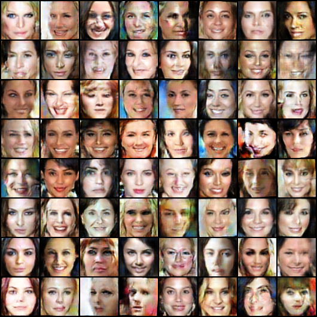

# Denoising Diffusion Probabilistic Model
Implementation of <a href="https://arxiv.org/abs/2006.11239">Denoising Diffusion Probabilistic Model</a> in Pytorch and trained on CelebA dataset. Writed with help of [1](https://github.com/tcapelle/Diffusion-Models-pytorch), [2](https://medium.com/mlearning-ai/enerating-images-with-ddpms-a-pytorch-implementation-cef5a2ba8cb1), [3](https://colab.research.google.com/github/huggingface/notebooks/blob/main/diffusers/training_example.ipynb#scrollTo=e3eb5811-c10b-4dae-a58d-9583c42e7f57)
## Sampling
### 1) `"normal"` mode
```bash
# e.g.,
python3 ../sample.py\
    --mode="normal"\
    --model_params="....pth
    --save_path="samples/normal/0.jpg"\
    --img_size=64\
    --batch_size=100\
```
- 
- 
### 2) `"interpolation"` mode
```bash
# e.g.,
python3 ../sample.py\
    --mode="interpolation"\
    --model_params="....pth
    --save_path="samples/interpolation/0.jpg"\
    --img_size=64
    --data_dir="/Users/jongbeomkim/Documents/datasets/"\
    --image_idx1=50\
    --image_idx2=100\
```
- `interpolate_at=500`
    - 
### 3) `"coarse_to_fine"` mode
```bash
# e.g.,
python3 ../sample.py\
    --mode="coarse_to_fine"\
    --model_params="....pth
    --save_path="samples/coarse_to_fine/0.jpg"\
    --img_size=64
    --data_dir="/Users/jongbeomkim/Documents/datasets/"\
    --image_idx1=50\
    --image_idx2=100\
```
- 

## Evaluation
```bash
# e.g.,
python3 eval.py
    --ckpt_path=".....pth"\
    --real_data_dir="../img_align_celeba/"\
    --gen_data_dir="../ddpm_eval_images/"\
    --batch_size=32\
    --n_eval_imgs=28000\
    --n_cpus=4\ # Optional
    --padding=1\ # Optional
    --n_cells=100 # Optional
```
# WGAN-GP-celeba
Pytorch implementation of Wasserstein GAN with Gradient penalty, trained on CelebA dataset.
Source code and training process are in [notebook](https://github.com/Dortp68/CelebA-generative/blob/main/WGAN-gp%20celeba.ipynb).

In this project, the model was trained on a custom dataset obtained using the face detection library ["DeepFace"](https://github.com/serengil/deepface), image size 64x64.
## Training
Model trained for `150 epochs` with parameters: `lr=1e-5`, `betas=(.9, .99)`, `latent_dim=100`, `gradien_penalty = 10`, `critic_iterations = 5`
### Trainig loss:

## Example of a generated image
All results are in the [folder](https://github.com/Dortp68/CelebA-generative/tree/main/images3)


